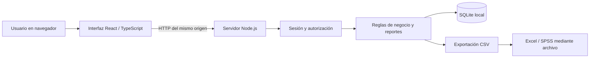
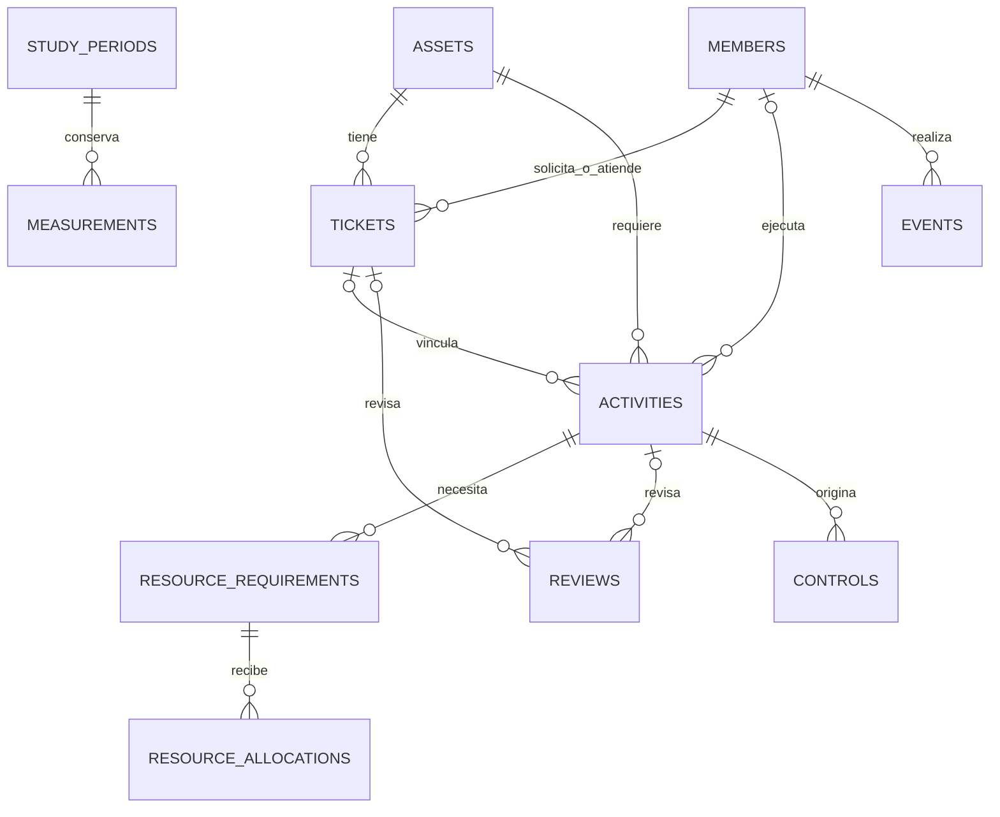

# Arquitectura y decisiones técnicas

## Contexto y dimensionamiento

Nexo es una aplicación web para centralizar la gestión de módulos ATM, sus incidencias y el trabajo operativo relacionado. La investigación no impone lenguaje, framework, proveedor cloud ni APIs. Se adopta una aplicación de una organización y una instancia de servidor, adecuada para demostración universitaria y operación de un equipo pequeño. No se añade multitenencia comercial, mensajería distribuida ni microservicios sin una necesidad demostrada.

El navegador presenta una interfaz React con TypeScript. Vite prepara los recursos del cliente. Un servidor Node.js procesa autenticación, consultas y acciones de negocio, y sirve la interfaz compilada. SQLite conserva los datos en disco. Esta separación permite mantener las reglas y cálculos independientemente de la presentación.

No es necesario contratar un servicio externo para iniciar sesión ni consultar registros. El funcionamiento operativo usa correo/contraseña propios; Excel y SPSS reciben archivos exportados, sin llamadas a sus APIs.

## Componentes y responsabilidades

| Capa | Responsabilidad | Decisión |
|---|---|---|
| Interfaz | Navegación, listados, formularios, detalle y estados de la operación. | React y TypeScript; textos en español, componentes reutilizables y diseño adaptable. |
| API | Interpretar solicitudes, comprobar sesión y origen, validar entradas y devolver errores. | Un servidor Node.js del mismo origen que la interfaz. |
| Dominio | Permisos por rol, transiciones, plazos, asignación y registro de evidencia. | Servicio central con validaciones Zod y consultas parametrizadas. |
| Reportes | Calcular 14 indicadores con intervalo, muestra, fórmula y procedencia. | SQL sobre registros persistidos; ausencia de datos expresada como valor nulo. |
| Investigación | Definir períodos y conservar observaciones semanales. | Capturas de 14 métricas en transacción y mediciones manuales documentadas. |
| Persistencia | Relaciones, restricciones, índices y registro histórico. | SQLite local con migraciones SQL versionadas. |
| Autenticación | Verificar contraseñas y mantener sesiones. | Derivación scrypt, sales por contraseña y cookie de sesión. |
| Intercambio | Extraer tickets, indicadores o mediciones. | CSV UTF-8 con BOM y escape de texto. |

Las versiones exactas se fijan en `package-lock.json`. La instalación de la entrega usa `npm ci` para repetir esa resolución. La versión mínima del runtime y los comandos de desarrollo/compilación se documentan en el README.

## Modelo de información

`members` identifica personas y permisos; los datos de autenticación se conservan por separado. `assets` mantiene equipos con código y serie únicos en su entorno. `tickets` relaciona solicitante, responsable y equipo, y separa primera respuesta, resolución y cierre. `activities` registra demanda, planificación y ejecución; puede pertenecer a un ticket o a trabajo preventivo independiente.

Los recursos separan lo requerido de cada entrega para medir cobertura y oportunidad. Las revisiones son hechos explícitos, independientes de crear un ticket. Las acciones correctivas relacionan hallazgo, responsable y evidencia. Las metas conservan criterio y evaluación. Las mediciones guardan fuente y evidencia; los eventos conservan las modificaciones relevantes.

Los identificadores relacionan los registros mediante claves foráneas. Los campos de estado aceptan valores definidos; cantidades positivas, fechas y exclusividad de mediciones tienen restricciones. Las migraciones añaden protecciones para reglas que deben mantenerse aun ante solicitudes simultáneas: impedir resolver con trabajo abierto, iniciar sin recursos o asignar cantidades excesivas.

## Integridad, concurrencia y fechas

Cada modificación de un registro versionado envía su `version`. El servidor actualiza solo si sigue vigente; un cambio concurrente provoca conflicto y solicita recargar. La modificación y su evento se guardan en una transacción. El registro de eventos y las mediciones guardadas no admiten edición o borrado como operaciones normales.

Los instantes se almacenan en ISO 8601 UTC. El cliente muestra e interpreta entradas para America/Lima. El plazo de ticket se obtiene desde su creación y la prioridad vigente: una reasignación no reinicia el cómputo. Son horas continuas; no hay calendario laboral ni pausa de SLA por espera.

Los reportes aplican cortes temporales y muestran sus fórmulas. Algunas cohortes se seleccionan por fecha de creación, otras por fecha de vencimiento o revisión, según el indicador. La auditoría permite reconstruir resolución, evaluación de metas y planificación/cancelación de actividades al corte; las pruebas incluyen cambios posteriores a ese corte. Las capturas semanales guardan valores y definiciones como instantáneas. El informe vivo depende de la versión de fórmulas y de los registros disponibles; no sustituye una captura conservada ni garantiza recuperar modificaciones hechas directamente por fuera de la aplicación.

## Seguridad

La autorización se comprueba en servidor para lecturas y escrituras. Un técnico accede a sus casos y tareas; un solicitante a sus tickets; supervisión ve la operación; el investigador consulta y captura mediciones sin modificar operación; solo administración gestiona cuentas. La simulación de roles queda restringida a demostración y no habilita privilegios en la base real.

Las contraseñas se verifican mediante scrypt con sal. Las sesiones utilizan tokens aleatorios y cookies; el servidor comprueba expiración y acceso habilitado. La configuración productiva debe servir HTTPS y marcar cookies seguras. No se envían contraseñas a hojas de cálculo ni se exportan credenciales.

La derivación utiliza scrypt N=65536, r=8, p=2, sal aleatoria de 16 bytes y resultado de 64 bytes. Los tokens de sesión tienen 32 bytes aleatorios; la base almacena su SHA-256, no el token de la cookie. Las cookies son HttpOnly, SameSite=Strict y vencen en ocho horas. Se limita la derivación concurrente al iniciar sesión y se bloquean temporalmente intentos repetidos. Las altas/cambios de contraseña están restringidos a cuentas autenticadas y autorizadas. Estas medidas no equivalen a una auditoría externa de seguridad.

Las entradas se validan en servidor, las consultas usan parámetros y las mutaciones comprueban el origen. Los errores de negocio se comunican en español; los errores internos tienen identificador para rastreo sin devolver trazas técnicas al navegador. Las exportaciones escapan el texto para reducir interpretación como fórmulas de hoja de cálculo.

La protección del archivo SQLite y de sus respaldos depende además de los permisos del sistema operativo y del equipo anfitrión. La aplicación no afirma cifrado transparente del disco ni anonimización automática de todo texto libre. La evidencia puede contener información institucional: se deben asignar cuentas individuales y revisar qué se comparte.

## Entornos y despliegue

El modo demostración utiliza `data/demo.sqlite` y personas/activos/casos ficticios. El modo real utiliza por defecto `data/nexo.sqlite`. El código fuente se puede compartir sin distribuir ninguna de esas bases. Cada instalación crea y mantiene sus propios registros.

La secuencia de entrega es instalación reproducible de dependencias, compilación, creación de primera cuenta real y arranque. Las migraciones acompañan el código para crear/actualizar el esquema. Un respaldo consistente debe hacerse antes de actualizar una instalación con datos reales.

Para exposición en una red o Internet se requiere configurar el host/origen, HTTPS mediante un servidor frontal, proceso supervisado y almacenamiento persistente. El archivo de base de datos debe quedar fuera de cualquier carpeta de archivos públicos. No se debe ubicar la base activa en una carpeta sincronizada entre varias computadoras para simular una base compartida: el acceso de usuarios debe pasar por el único servidor.

SQLite es apropiado para este tamaño de solución y simplifica la entrega. No se ha supuesto alta disponibilidad ni un número elevado de escritores simultáneos. Si la operación exige múltiples réplicas, gran concurrencia o políticas corporativas de base centralizada, corresponde migrar el adaptador a una base cliente/servidor y volver a ejecutar las pruebas.

## Integraciones y límites

| Integración | Información y ejecución | Autenticación | Estado/alcance |
|---|---|---|---|
| Excel mediante CSV | Tickets filtrados, 14 indicadores o mediciones; descarga iniciada por usuario. | Sesión Nexo; no requiere cuenta Microsoft. | Exportador disponible; importar escogiendo UTF-8 y coma. |
| SPSS mediante CSV | Observaciones e indicadores con fuente, muestra y procedencia. | Sesión Nexo para descargar; licencia externa para usar SPSS. | Formato preparado; ejecución del análisis/importación en SPSS depende de esa instalación. |
| ATM físico | Ninguno. | No aplica. | Fuera del alcance documentado; el inventario se actualiza manualmente. |
| Correo, SMS u otros servicios empresariales | Ninguno. | No aplica. | No se requieren en la investigación entregada. |

La fuente menciona Excel para organizar registros y SPSS para análisis metodológico. El intercambio por archivo es una propuesta que satisface esa necesidad sin inventar servicios externos ni credenciales faltantes. No se implementan modelos de aprendizaje automático ni se atribuyen métricas predictivas.

## Criterio de mantenimiento

Los cambios de reglas deben actualizar código, pruebas, manual y matriz de requisitos juntos. Modificar plazos o fórmulas durante la recolección puede romper comparabilidad; registra la versión y fecha de vigencia del cambio. No sobrescribas capturas previas para hacerlas coincidir con una fórmula nueva. Las licencias de componentes y dependencias se conservan en la entrega.
